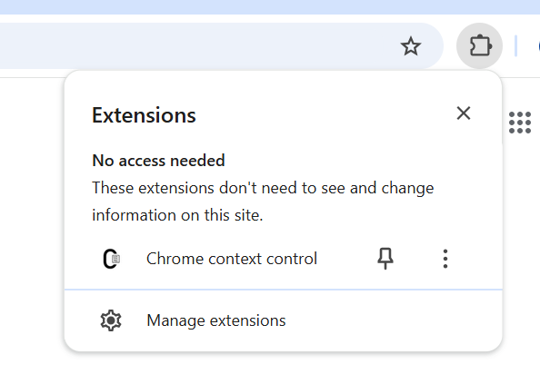
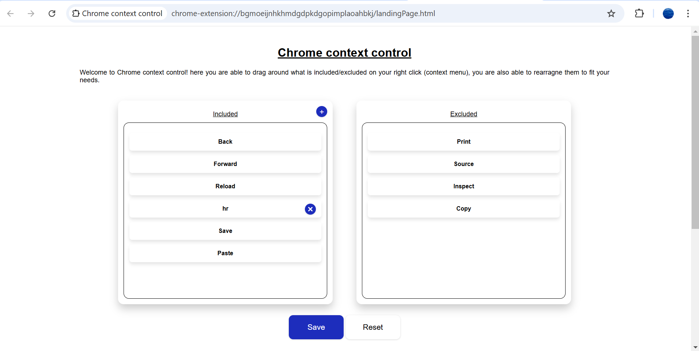
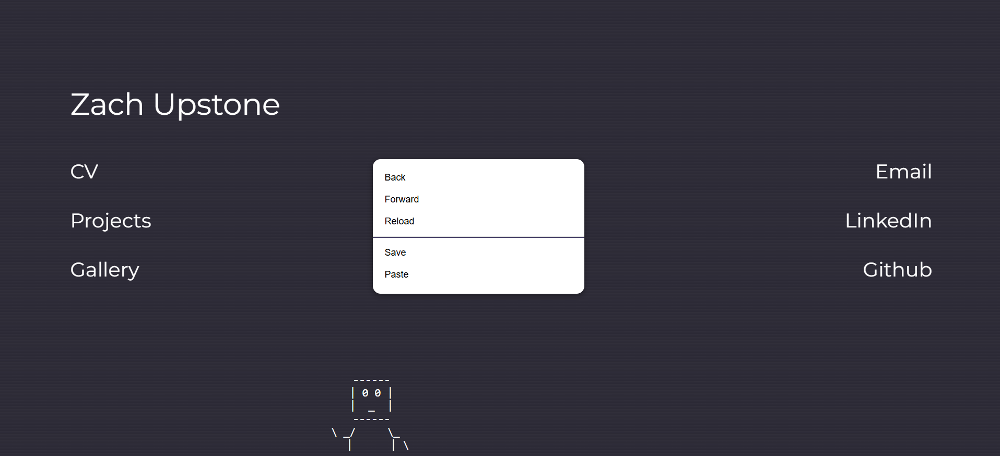
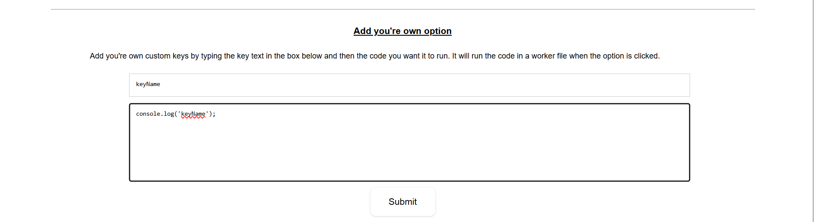
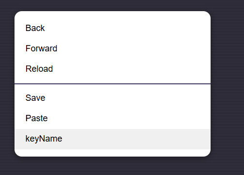
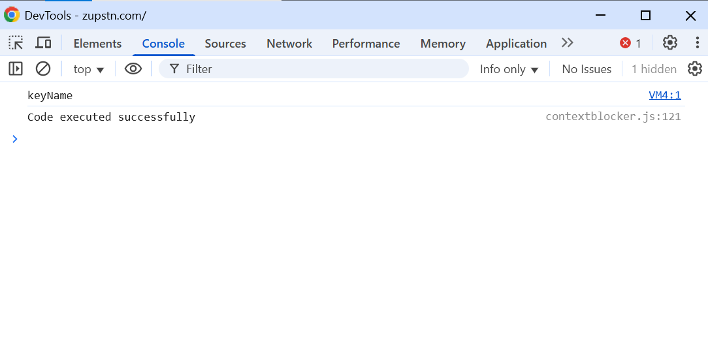

# Chrome context control

Welcome to Chrome Context Control! This repo contains code for a chrome extension that allows users more control over Chrome's right-click context menu.

<b>Important note - Chrome extensions do not run on Chrome pages i.e. <a href="chrome://flags">chrome://flags</a>, <a href="chrome://extensions">chrome://extensions</a> or <a href="chrome://newtab">chrome://newtab</a> (Links wont open if chrome isn't your default browser).</b>

## Setup
To utilise this code visit <a href="chrome://extensions">chrome://extensions</a> (you have to be logged into a chrome account) and press "Load unpacked", then navigate to this repo's folder on your local device and press "select folder". You will have to refresh any valid (as mentioned earlier) pages before being able to see the updates you've made. You should be able to access the Chrome extension landing page by navigating to it by pressing the jigsaw button in the top right of the screen

## Use

### Customising the context menu
Once setup this extension will allow you to edit the context menu by naviagating to the landing page. Once on the page you can drag the contents you don't want in the menu to the excluded list and re-arrange what you do want to include. Once done press "Save" and then refresh any valid pages to see the updates take effect.

### Adding custom code options
Furthermore this extension also allows you to add custom code that will be run by a Chrome worker. To achieve this 
scroll down on the landing page and enter a key (the nameyou want for the button on the context menu) and the relevant js code (e.g. "console.log('test');" ), then press "Submit".

 
<b>Important note - Chrome does not allow programatic opening of developer tools, therefore, these options on the custom context menu do not work.</b>

## Notes about creating a chrome extension

To start developing/using a basic Chrome extension I recommend this guide <a href="https://developer.chrome.com/docs/extensions/mv3/getstarted/development-basics/#load-unpacked">here</a>. This sets up a basic extension where you can add something to the context menu.

## Future
- TODO: Add delete for custom functions
- TODO: Add check for duplicate custom fucntions
- TODO: Make it scrollable.